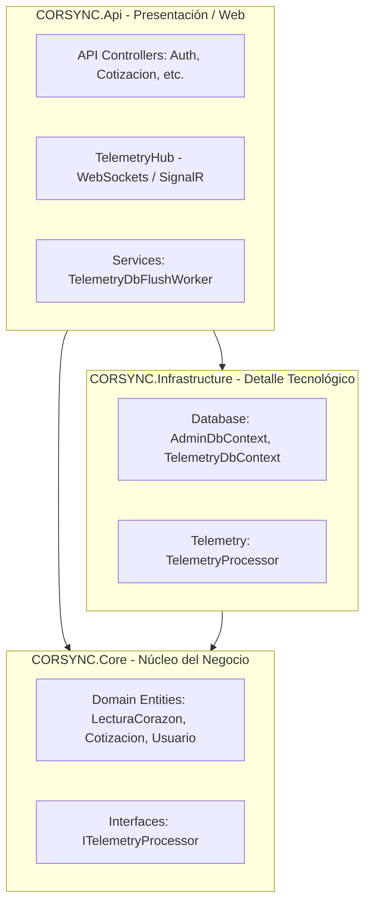
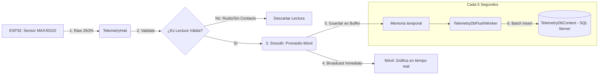

# Documento de Arquitectura General: CORSYNC Backend

Este documento detalla la arquitectura de software del backend de **CORSYNC**, explicando su propósito general, sus módulos, y profundizando en el diseño del **Puente de Telemetría (Bridge)** que comunica en tiempo real el hardware IoT con la aplicación móvil.

---

## 1. Contexto del Proyecto

CORSYNC es una plataforma híbrida que unifica la gestión administrativa y la telemetría biométrica en tiempo real. El backend está construido en **.NET 8** utilizando los principios de **Clean Architecture** (Arquitectura Limpia), lo que garantiza la separación de responsabilidades, testabilidad y mantenibilidad.

### Módulos Principales
1. **Módulo de Administración**: Diseñado para el negocio. Administra el catálogo de materias primas, proveedores, cálculo de cotizaciones de productos, comentarios y autenticación de usuarios.
2. **Módulo de Telemetría (El Puente / Bridge)**: Diseñado para la salud y rendimiento. Actúa como un intermediario bidireccional de baja latencia que recibe datos de sensores del prototipo IoT (pulso e infrarrojo del `MAX30102`, así como conductancia galvánica `GSR` y clasificación de `Aura`), los limpia y consolida en tiempo real y los transmite a la aplicación móvil.

---

## 2. Diagrama de Arquitectura de Capas

El backend sigue una arquitectura limpia estructurada en tres proyectos principales:



---

## 3. El Puente de Telemetría (Bridge) en Detalle

El **Bridge** es el subsistema de comunicación en tiempo real que resuelve el problema de la conectividad en redes privadas para IoT. 

En lugar de que la aplicación móvil se conecte directamente al hardware IoT (lo cual es casi imposible cuando están en redes móviles o redes Wi-Fi diferentes detrás de NATs), **ambos se conectan a un puente central en la nube (el Backend de CORSYNC)**.

```
┌───────────────┐               ┌───────────────────────┐               ┌────────────────┐
│  Aplicación   │  WebSockets   │   CORSYNC Backend     │  WebSockets   │ Prototipo IoT  │
│  Móvil        │ <───────────> │  (TelemetryHub/Bridge)│ <───────────> │ (Sensor ESP32) │
└───────────────┘   (SignalR)   └───────────────────────┘   (SignalR)   └────────────────┘
```

### Componentes que Integran el Puente

Para que este puente sea eficiente, seguro y no sature la infraestructura, se implementaron tres componentes clave:

| Componente | Capa | Función Principal | Archivo |
| :--- | :--- | :--- | :--- |
| **`TelemetryHub`** | `Api` | Gestiona el ciclo de vida de la conexión WebSocket, rutea comandos del móvil al IoT e inyecta los datos entrantes del IoT al procesador. | [TelemetryHub.cs](file:///C:/Users/damia/Documents/CORSYNC-Backend/Src/CORSYNC.Api/Hubs/TelemetryHub.cs) |
| **`TelemetryProcessor`** | `Infrastructure` / `Core` | Realiza el filtrado de valores atípicos (outliers) y aplica un suavizado (promedio móvil) a los BPM para evitar picos inestables en la gráfica del móvil. | [TelemetryProcessor.cs](file:///C:/Users/damia/Documents/CORSYNC-Backend/Src/CORSYNC.Infrastructure/Telemetry/TelemetryProcessor.cs) |
| **`TelemetryDbFlushWorker`** | `Infrastructure` | Un servicio en segundo plano (worker) que toma las lecturas acumuladas en memoria y las guarda de manera agrupada cada 5 segundos para proteger la base de datos (Throttling). | [TelemetryDbFlushWorker.cs](file:///C:/Users/damia/Documents/CORSYNC-Backend/Src/CORSYNC.Infrastructure/Telemetry/TelemetryDbFlushWorker.cs) |

---

## 4. Flujo de Datos del Puente (Bridge Pipeline)

El ciclo de procesamiento de una lectura desde el sensor físico hasta la pantalla del usuario se comporta de la siguiente manera:



### Explicación del Bucle de Datos:
1. **Ingreso (Ingress)**: El ESP32 lee los fotodiodos del sensor `MAX30102` (infrarrojo y rojo) y calcula los pulsos. Envía un JSON al `TelemetryHub` a través de WebSocket.
2. **Validación (Filtrado)**: El `TelemetryProcessor` rechaza lecturas erróneas. Por ejemplo, valores de pulso menores a 30 o mayores a 220 BPM, o si la intensidad de luz infrarroja (`IR < 50000`), lo que indica que el usuario no tiene el dedo puesto sobre el sensor.
3. **Suavizado (Smoothing)**: Las pulsaciones cardíacas físicas fluctúan debido a artefactos de movimiento. El procesador aplica un promedio móvil con una ventana de las últimas 5 lecturas para estabilizar la curva antes de enviarla al usuario.
4. **Despacho (Egress)**: La lectura procesada se envía inmediatamente mediante SignalR al grupo de la app móvil vinculada, proporcionando una sensación de latencia cero.
5. **Mitigación de Base de Datos (Throttling)**: Guardar 5 registros por segundo en una base de datos relacional para cientos de usuarios causaría un cuello de botella masivo. El Bridge soluciona esto guardando las lecturas en un buffer y consolidándolas en un solo registro consolidado (con los promedios del periodo) cada 5 segundos.

---

## 5. Decisiones de Diseño y Seguridad

* **Grupos Dinámicos en SignalR**: Las conexiones móviles e IoT no se comunican de forma global. Al conectarse, ingresan a salas aisladas llamadas `device_{deviceId}` y `mobile_{deviceId}`. Esto evita la fuga de información biométrica entre usuarios.
* **Autenticación Unificada**: El puente requiere que la aplicación móvil pase un Token JWT válido en la URL de handshake. El servidor valida la firma de este token antes de permitir la elevación de protocolo de HTTP a WebSockets.
* **Resiliencia de Hardware**: El protocolo define comandos de encendido y apagado del hardware (`StartTelemetry` y `StopTelemetry`). Si la aplicación móvil se desconecta de forma imprevista, el Hub detecta la desconexión del socket y puede apagar automáticamente el sensor en el ESP32 para preservar batería.
