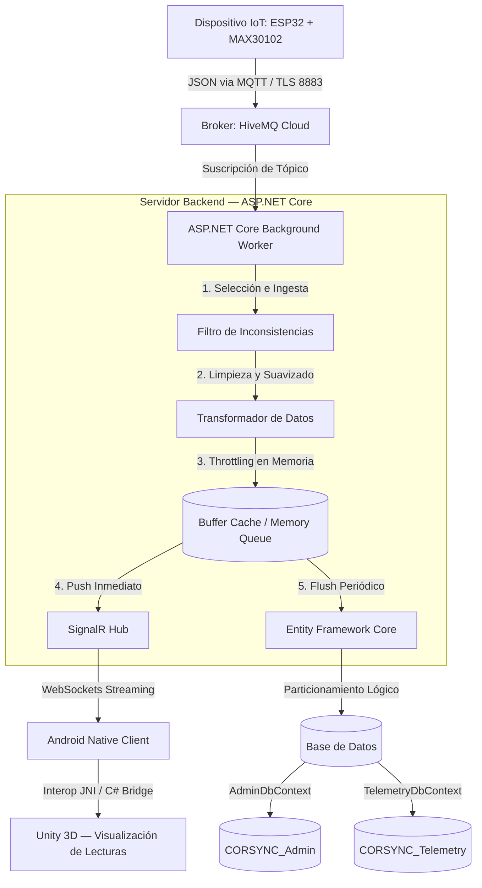

# CORSYNC — Sistema de Telemetría Biométrica en Tiempo Real

## 1. Resumen Ejecutivo

**CORSYNC** es una plataforma de telemetría IoT en tiempo real que captura, procesa y visualiza lecturas de frecuencia cardíaca y señal infrarroja obtenidas desde sensores físicos (ESP32 + MAX30102). El sistema transmite los datos a través de un broker MQTT, los limpia y transforma en un backend ASP.NET Core, y los entrega simultáneamente a una aplicación móvil Android con visualización 3D embebida en Unity y a una base de datos relacional para análisis histórico.

El proyecto se complementa con una **plataforma web comercial y administrativa** que gestiona la cotización de productos, la cadena de suministro de materia prima, el inventario, los proveedores y el ciclo de vida del cliente.

---

## 2. Arquitectura del Ecosistema y Flujo de Datos

El sistema implementa una arquitectura desacoplada basada en un **Monolito Modular** con ingesta asíncrona mediante un Background Worker y streaming bidireccional por WebSockets (SignalR).



### Descripción del Flujo
1. **Captura y Transmisión:** El microcontrolador **ESP32** lee los valores de absorción infrarroja (IR) y calcula el pulso cardíaco mediante el sensor **MAX30102**, emitiendo un payload JSON al broker **HiveMQ Cloud** bajo TLS (puerto 8883).
2. **Ingesta y Limpieza:** El **Background Worker** en ASP.NET Core se suscribe al tópico del broker e intercepta el flujo de datos raw para descartar lecturas erráticas causadas por ruido de movimiento o pérdida de contacto.
3. **Throttling y Caché:** Los datos se acumulan temporalmente en un búfer en memoria antes de ser persistidos de forma agregada, evitando saturar el DBMS con inserciones de alta frecuencia.
4. **Streaming en Tiempo Real:** En paralelo a la persistencia, los valores procesados se envían vía **SignalR** a la aplicación móvil para su renderizado inmediato.
5. **Visualización 3D:** La aplicación Android recibe el flujo y alimenta el motor embebido de **Unity 3D**, donde las métricas de pulso e IR se traducen en propiedades visuales del renderizado (densidad de partículas, gradientes cromáticos, velocidad de animación).

---

## 3. Estrategia de Ingesta, Limpieza y Almacenamiento

### Selección, Limpieza y Transformación de Datos
El sensor MAX30102 es susceptible a artefactos de movimiento y pérdidas momentáneas de contacto con la piel. El pipeline de ingesta del Background Worker aplica las siguientes políticas de calidad de datos:

* **Filtro de Rangos Físicos (Outliers):** Se descartan lecturas de pulso instantáneo (`bpm`) inferiores a 30 BPM o superiores a 220 BPM, ya que están fuera del rango fisiológico humano.
* **Validación de Señal Infrarroja:** Si el valor de `ir` es inferior a un umbral base (ej. 50,000 unidades), el sistema interpreta que el sensor no tiene contacto con la piel y emite una trama de desconexión en lugar de datos erróneos.
* **Filtro de Media Móvil:** Se aplica un filtro paso bajo en memoria para suavizar fluctuaciones rápidas no fisiológicas antes del almacenamiento y la transmisión.

### Técnica de Throttling en Memoria
Para proteger la durabilidad del DBMS se utiliza un patrón de acumulación en memoria con colas concurrentes (`ConcurrentQueue<T>`):

* El sensor transmite a ~20-50 Hz (20 a 50 tramas por segundo).
* El Background Worker acumula las lecturas en caché y calcula el promedio ponderado de BPM e IR cada **5 segundos** (configurable).
* Al cumplirse la ventana temporal se genera un único registro consolidado, reduciendo la carga de transacciones sobre la base de datos en más de un **95%**.

### Especificaciones de Integración

#### Payload Crudo del Sensor Cardíaco (JSON enviado por ESP32 al Broker)
```json
{
  "ir": 102531,
  "bpm": 5.6,
  "bpmAvg": 68
}
```

#### Modelo de Persistencia — Lecturas de Corazón (Entity Framework Core)
```csharp
using System;
using System.ComponentModel.DataAnnotations;
using System.ComponentModel.DataAnnotations.Schema;

namespace CORSYNC.Core.Domain
{
    public class LecturaCorazon
    {
        [Key]
        [DatabaseGenerated(DatabaseGeneratedOption.Identity)]
        public int Id { get; set; }

        [Required]
        [MaxLength(50)]
        public string DispositivoId { get; set; } = "ESP32_MAX30102";

        public long IR { get; set; }

        [Column(TypeName = "decimal(5,1)")]
        public decimal BPM { get; set; }

        public int BPMPromedio { get; set; }

        public DateTime FechaHora { get; set; } = DateTime.UtcNow;
    }
}
```

---

## 4. Sensores y Módulos de Telemetría

El sistema contempla la integración de **dos módulos de sensorización**. A continuación se describe el estado actual de cada uno:

### Sensor de Pulso Cardíaco — MAX30102 ✅ Implementado
* **Hardware:** Módulo MAX30102 conectado al ESP32 vía I2C.
* **Datos Capturados:** Señal infrarroja (IR), pulso instantáneo (BPM) y promedio de BPM.
* **Estado:** Pipeline completo de ingesta, limpieza, persistencia y streaming en tiempo real.

### Sensor de Respuesta Galvánica de la Piel (GSR) ⚠️ Pendiente
* **Hardware previsto:** Módulo sensor GSR (ej. Grove GSR v1.2 o equivalente) conectado al ESP32 vía entrada analógica.
* **Datos a capturar:** Nivel de conductancia de la piel (µS), resistencia cutánea y variaciones asociadas al estado de activación fisiológica (estrés, relajación).
* **Estado:** **No implementado.** Este módulo se encuentra **pendiente de desarrollo**. Se requiere:
  - Definición del payload JSON del sensor GSR.
  - Modelo de persistencia `LecturaPiel` en Entity Framework Core.
  - Integración al pipeline del Background Worker (tópico MQTT dedicado o extensión del payload actual).
  - Adaptación de los Hubs de SignalR para transmitir las lecturas de piel en paralelo a las cardíacas.
  - Incorporación de la visualización GSR en la aplicación móvil y en las gráficas históricas.

> **Nota para el equipo:** La arquitectura actual está diseñada para soportar múltiples flujos de sensorización. La incorporación del módulo GSR debe seguir el mismo patrón de ingesta ya establecido para el MAX30102 (tópico MQTT → Background Worker → limpieza → throttling → SignalR + EF Core).

---

## 5. Módulos de la Aplicación Móvil (Android & Unity)

La aplicación móvil es el canal principal de interacción del usuario con el sistema de lecturas biométricas:

1. **Login / Register:**
   * Autenticación mediante JWT y formularios de registro estándar.
   * Creación de perfil del usuario con datos básicos para personalización del dashboard.

2. **Escáner Home (Unity Embedded):**
   * Panel principal que incrusta el entorno de Unity 3D dentro del layout nativo de Android.
   * Enlace en tiempo real que mapea las métricas de `BPM` e `IR` a variables del sistema de partículas (ej. el pulso altera la frecuencia de pulsación visual, la intensidad de la señal IR modula la densidad del renderizado).

3. **Gráficas e Historial de Lecturas:**
   * Visualización interactiva del comportamiento biométrico: gráficos lineales de pulso cardíaco, dispersión de señal IR y tendencias históricas.
   * Resúmenes diarios y semanales con promedios, máximos, mínimos y alertas de lecturas fuera de rango.

4. **Diario Personal:**
   * Bitácora donde el usuario registra manualmente su estado percibido y lo contrasta con los datos capturados por el sensor.

5. **Perfil y Configuración:**
   * Vinculación de dispositivos IoT mediante Bluetooth Low Energy (BLE) o aprovisionamiento Wi-Fi para MQTT.
   * Configuración de preferencias de visualización (esquema de colores, umbrales de alerta).

6. **Gamificación:**
   * Sistema de logros y recompensas basado en la consistencia de uso diario, registros de estados estables de relajación (BPM bajos sostenidos) y cumplimiento de metas de bienestar.

---

## 6. Módulos del Sistema Web Comercial (Backoffice y Portal)

La plataforma web administra la operación comercial, la cadena de suministro y el ciclo de vida del cliente. Segmentada en tres secciones con control de acceso basado en roles (RBAC):

### A. Sección Pública
* **Landing Page:** Presentación del producto y sus capacidades técnicas de monitoreo biométrico en tiempo real.
* **Empresa / Producto:** Descripción de la empresa, el equipo y la propuesta de valor del sistema.
* **Comentarios de Clientes:** Sección de testimonios con opiniones aprobadas por moderación.
* **Cotizador Dinámico:**
  * Formulario interactivo de cotización basado en el método de costeo de materia prima.
  * Calcula el costo del producto según los componentes seleccionados (dimensiones, tipo de marco, sensores, componentes electrónicos) más costos de ensamblaje.
  * Genera cotización formal descargable en PDF.

### B. Sección Administrador
* **Gestión de Usuarios:** Creación, edición y suspensión de cuentas (clientes, administradores, soporte).
* **Seguimiento de Comentarios:** Moderación de testimonios con aprobación, rechazo y control de spam.
* **Gestión de Proveedores:** Registro de proveedores de componentes electrónicos (ESP32, MAX30102, cableado) e insumos físicos (marcos, resinas, cristales).
* **Compras y Abastecimiento:** Órdenes de compra con alertas automáticas cuando el stock desciende del mínimo de seguridad.
* **Inventario de Materia Prima:** Control de existencias en almacén (hardware y materiales de manufactura).
* **Explosión de Materiales (BOM — Bill of Materials):**
  * Definición de recetas de producto para cada modelo (estándar, premium, corporativo).
  * Desglose jerárquico de componentes para cálculo de costos y planificación de producción.

### C. Sección Clientes
* **Documentación del Producto:** Descarga de manuales de usuario, guías de montaje y documentación técnica del sensor.
* **Historial de Compras:** Consulta de pedidos, estados de envío, facturas y cotizaciones previas.
* **Panel de Opiniones:** Formulario para que clientes verificados califiquen su experiencia con el producto.

---

## 7. Cronograma de Planeación del Backend (Fases de Implementación)

La implementación del backend en ASP.NET Core se organiza en **tres fases principales** con alcance incremental:

| Fase | Título | Descripción de Actividades | Entregables Principales | Estado |
| :---: | :--- | :--- | :--- | :---: |
| **1** | Infraestructura y Modelos | Configuración del proyecto monolítico, diseño de las bases de datos particionadas (`CORSYNC_Admin`, `CORSYNC_Telemetry`), modelado de entidades con EF Core y migraciones iniciales. | `AdminDbContext`, `TelemetryDbContext`, modelo `LecturaCorazon`, esquemas de tablas aplicados. | ⬜ Pendiente |
| **2** | Ingesta MQTT Bridge | Implementación del `IHostedService` (Background Worker) para suscripción al broker HiveMQ Cloud bajo TLS. Pipeline de sanitización, filtros de outliers y throttling en memoria con flush periódico a BD. | Background Worker funcional, pipeline de limpieza de datos, lógica de guardado en lote cada N segundos. | ⬜ Pendiente |
| **3** | Streaming SignalR y API REST | Desarrollo de los Hubs de SignalR para push de lecturas en tiempo real. Construcción de endpoints REST para administración, cotizador dinámico, autenticación JWT y CRUD del backoffice. | SignalR Hub, API Controllers (cotizador, usuarios, inventario, proveedores), autenticación JWT. | ⬜ Pendiente |

### Tareas Pendientes Fuera de Fase (Backlog)

| Tarea | Descripción | Prioridad |
| :--- | :--- | :---: |
| Módulo Sensor GSR (Piel) | Definir payload JSON, modelo `LecturaPiel`, tópico MQTT, integración al Background Worker, adaptación de SignalR y gráficas en la app móvil. | 🔴 Alta |
| Gamificación Backend | Endpoints de logros, sistema de puntos y persistencia de hitos del usuario. | 🟡 Media |
| Exportación de Reportes | Generación de reportes PDF/Excel desde el panel administrativo (ventas, inventario, telemetría). | 🟡 Media |

---

## 8. Instrucciones de Despliegue y Configuración

### Requisitos Previos
* **Runtime:** .NET 8.0 SDK o superior.
* **Base de Datos:** Microsoft SQL Server o MySQL Server.
* **Broker MQTT:** Cuenta activa en HiveMQ Cloud con TLS habilitado.

### Configuración del Entorno (`appsettings.json`)

```json
{
  "ConnectionStrings": {
    "AdminConnection": "Server=localhost;Database=CORSYNC_Admin;User Id=sa;Password=<TU_PASSWORD>;TrustServerCertificate=True;",
    "TelemetryConnection": "Server=localhost;Database=CORSYNC_Telemetry;User Id=sa;Password=<TU_PASSWORD>;TrustServerCertificate=True;"
  },
  "HiveMQ": {
    "Host": "<TU_BROKER_ID>.s1.eu.hivemq.cloud",
    "Port": 8883,
    "Username": "<USUARIO_MQTT>",
    "Password": "<PASSWORD_MQTT>",
    "UseTls": true
  },
  "TokenConfiguration": {
    "SecretKey": "<CLAVE_SECRETA_JWT_MIN_256_BITS>",
    "Issuer": "CORSYNCServer",
    "Audience": "CORSYNCClients"
  }
}
```

### Variables de Entorno Requeridas

| Variable | Descripción | Ejemplo |
| :--- | :--- | :--- |
| `ConnectionStrings__AdminConnection` | Cadena de conexión a la BD administrativa | `Server=localhost;Database=CORSYNC_Admin;...` |
| `ConnectionStrings__TelemetryConnection` | Cadena de conexión a la BD de telemetría | `Server=localhost;Database=CORSYNC_Telemetry;...` |
| `HiveMQ__Host` | Host del broker HiveMQ Cloud | `abc123.s1.eu.hivemq.cloud` |
| `HiveMQ__Port` | Puerto MQTT con TLS | `8883` |
| `HiveMQ__Username` | Usuario de autenticación MQTT | `App_Gateway_Client` |
| `HiveMQ__Password` | Contraseña del broker MQTT | `*****` |
| `HiveMQ__UseTls` | Habilitar conexión TLS/SSL | `true` |

### Ejecución en Consola
```bash
# 1. Restaurar dependencias
dotnet restore

# 2. Aplicar migraciones de base de datos
dotnet ef database update --context AdminDbContext
dotnet ef database update --context TelemetryDbContext

# 3. Compilar y ejecutar el servidor
dotnet run --project Src/CORSYNC.Api/CORSYNC.Api.csproj
```
