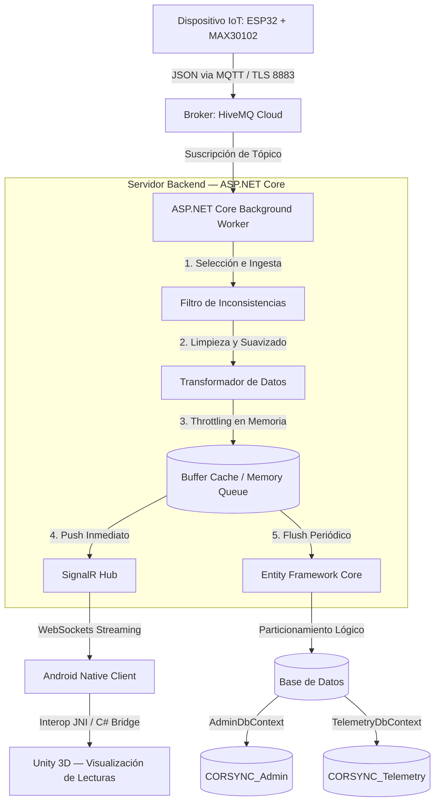

# CORSYNC — Sistema de Telemetría Biométrica en Tiempo Real

## 1. Resumen Ejecutivo

**CORSYNC** es una plataforma de telemetría IoT en tiempo real que captura, procesa y visualiza lecturas de frecuencia cardíaca y señal infrarroja obtenidas desde sensores físicos (ESP32 + MAX30102). El sistema transmite los datos a través de un broker MQTT, los limpia y transforma en un backend ASP.NET Core, y los entrega simultáneamente a una aplicación móvil Android con visualización 3D embebida en Unity y a una base de datos relacional para análisis histórico.

El proyecto se complementa con una **plataforma web comercial y administrativa** que gestiona la cotización de productos, la cadena de suministro de materia prima, el inventario, los proveedores y el ciclo de vida del cliente.

---

## 2. Arquitectura del Ecosistema y Flujo de Datos

El sistema implementa una arquitectura desacoplada basada en un **Monolito Modular** con ingesta asíncrona mediante un Background Worker y streaming bidireccional por WebSockets (SignalR).


```mermaid
graph TD
    ESP32["Dispositivo IoT: ESP32 + MAX30102"] -->|JSON via MQTT / TLS 8883| HiveMQ["Broker: HiveMQ Cloud"]
    HiveMQ -->|Suscripción de Tópico| BackgroundWorker["ASP.NET Core Background Worker"]

    subgraph "Servidor Backend — ASP.NET Core"
        BackgroundWorker -->|1. Selección e Ingesta| InputPipeline["Filtro de Inconsistencias"]
        InputPipeline -->|2. Limpieza y Suavizado| DataTransform["Transformador de Datos"]
        DataTransform -->|3. Throttling en Memoria| BufferCache[("Buffer Cache / Memory Queue")]

        BufferCache -->|4. Push Inmediato| SignalR["SignalR Hub"]
        BufferCache -->|5. Flush Periódico| EFCore["Entity Framework Core"]
    end

    EFCore -->|Particionamiento Lógico| DB[("Base de Datos")]
    DB -->|AdminDbContext| DBAdmin[("CORSYNC_Admin")]
    DB -->|TelemetryDbContext| DBTelemetry[("CORSYNC_Telemetry")]

    SignalR -->|WebSockets Streaming| MobileApp["Android Native Client"]
    MobileApp -->|Interop JNI / C# Bridge| UnityEngine["Unity 3D — Visualización de Lecturas"]
```

### Descripción del Flujo
1. **Captura y Transmisión:** El microcontrolador **ESP32** lee los valores de absorción infrarroja (IR) y calcula el pulso cardíaco mediante el sensor **MAX30102**, emitiendo un payload JSON al broker **HiveMQ Cloud** bajo TLS (puerto 8883).
2. **Ingesta y Limpieza:** El **Background Worker** en ASP.NET Core se suscribe al tópico del broker e intercepta el flujo de datos raw para descartar lecturas erráticas causadas por ruido de movimiento o pérdida de contacto.
3. **Throttling y Caché:** Los datos se acumulan temporalmente en un búfer en memoria antes de ser persistidos de forma agregada, evitando saturar el DBMS con inserciones de alta frecuencia.
4. **Streaming en Tiempo Real:** En paralelo a la persistencia, los valores procesados se envían vía **SignalR** a la aplicación móvil para su renderizado inmediato.
5. **Visualización 3D:** La aplicación Android recibe el flujo y alimenta el motor embebido de **Unity 3D**, donde las métricas de pulso e IR se traducen en propiedades visuales del renderizado (densidad de partículas, gradientes cromáticos, velocidad de animación).

---

## 3. Estrategia de Ingesta, Limpieza y Almacenamiento

### Selección, Limpieza y Transformación de Datos
El sensor MAX30102 es susceptible a artefactos de movimiento y pérdidas momentáneas de contacto con la piel. El pipeline de ingesta del Background Worker aplica las siguientes políticas de calidad de datos:

* **Filtro de Rangos Físicos (Outliers):** Se descartan lecturas de pulso instantáneo (`bpm`) inferiores a 30 BPM o superiores a 220 BPM, ya que están fuera del rango fisiológico humano.
* **Validación de Señal Infrarroja:** Si el valor de `ir` es inferior a un umbral base (ej. 50,000 unidades), el sistema interpreta que el sensor no tiene contacto con la piel y emite una trama de desconexión en lugar de datos erróneos.
* **Filtro de Media Móvil:** Se aplica un filtro paso bajo en memoria para suavizar fluctuaciones rápidas no fisiológicas antes del almacenamiento y la transmisión.

### Técnica de Throttling en Memoria
Para proteger la durabilidad del DBMS se utiliza un patrón de acumulación en memoria con colas concurrentes (`ConcurrentQueue<T>`):

* El sensor transmite a ~20-50 Hz (20 a 50 tramas por segundo).
* El Background Worker acumula las lecturas en caché y calcula el promedio ponderado de BPM e IR cada **5 segundos** (configurable).
* Al cumplirse la ventana temporal se genera un único registro consolidado, reduciendo la carga de transacciones sobre la base de datos en más de un **95%**.

### Especificaciones de Integración

#### Payload Crudo del Sensor Cardíaco (JSON enviado por ESP32 al Broker)
```json
{
  "ir": 102531,
  "bpm": 5.6,
  "bpmAvg": 68
}
```

#### Modelo de Persistencia — Lecturas de Corazón (Entity Framework Core)
```csharp
using System;
using System.ComponentModel.DataAnnotations;
using System.ComponentModel.DataAnnotations.Schema;

namespace CORSYNC.Core.Domain
{
    public class LecturaCorazon
    {
        [Key]
        [DatabaseGenerated(DatabaseGeneratedOption.Identity)]
        public int Id { get; set; }

        [Required]
        [MaxLength(50)]
        public string DispositivoId { get; set; } = "ESP32_MAX30102";

        public long IR { get; set; }

        [Column(TypeName = "decimal(5,1)")]
        public decimal BPM { get; set; }

        public int BPMPromedio { get; set; }

        public DateTime FechaHora { get; set; } = DateTime.UtcNow;
    }
}
```

---

## 4. Sensores y Módulos de Telemetría

El sistema contempla la integración de **dos módulos de sensorización**. A continuación se describe el estado actual de cada uno:

### Sensor de Pulso Cardíaco — MAX30102 ✅ Implementado
* **Hardware:** Módulo MAX30102 conectado al ESP32 vía I2C.
* **Datos Capturados:** Señal infrarroja (IR), pulso instantáneo (BPM) y promedio de BPM.
* **Estado:** Pipeline completo de ingesta, limpieza, persistencia y streaming en tiempo real.

### Sensor de Respuesta Galvánica de la Piel (GSR) ⚠️ Pendiente
* **Hardware previsto:** Módulo sensor GSR (ej. Grove GSR v1.2 o equivalente) conectado al ESP32 vía entrada analógica.
* **Datos a capturar:** Nivel de conductancia de la piel (µS), resistencia cutánea y variaciones asociadas al estado de activación fisiológica (estrés, relajación).
* **Estado:** **No implementado.** Este módulo se encuentra **pendiente de desarrollo**. Se requiere:
  - Definición del payload JSON del sensor GSR.
  - Modelo de persistencia `LecturaPiel` en Entity Framework Core.
  - Integración al pipeline del Background Worker (tópico MQTT dedicado o extensión del payload actual).
  - Adaptación de los Hubs de SignalR para transmitir las lecturas de piel en paralelo a las cardíacas.
  - Incorporación de la visualización GSR en la aplicación móvil y en las gráficas históricas.

> **Nota para el equipo:** La arquitectura actual está diseñada para soportar múltiples flujos de sensorización. La incorporación del módulo GSR debe seguir el mismo patrón de ingesta ya establecido para el MAX30102 (tópico MQTT → Background Worker → limpieza → throttling → SignalR + EF Core).

---

## 5. Módulos de la Aplicación Móvil (Android & Unity)

La aplicación móvil es el canal principal de interacción del usuario con el sistema de lecturas biométricas:

1. **Login / Register:**
   * Autenticación mediante JWT y formularios de registro estándar.
   * Creación de perfil del usuario con datos básicos para personalización del dashboard.

2. **Escáner Home (Unity Embedded):**
   * Panel principal que incrusta el entorno de Unity 3D dentro del layout nativo de Android.
   * Enlace en tiempo real que mapea las métricas de `BPM` e `IR` a variables del sistema de partículas (ej. el pulso altera la frecuencia de pulsación visual, la intensidad de la señal IR modula la densidad del renderizado).

3. **Gráficas e Historial de Lecturas:**
   * Visualización interactiva del comportamiento biométrico: gráficos lineales de pulso cardíaco, dispersión de señal IR y tendencias históricas.
   * Resúmenes diarios y semanales con promedios, máximos, mínimos y alertas de lecturas fuera de rango.

4. **Diario Personal:**
   * Bitácora donde el usuario registra manualmente su estado percibido y lo contrasta con los datos capturados por el sensor.

5. **Perfil y Configuración:**
   * Vinculación de dispositivos IoT mediante aprovisionamiento Wi-Fi para MQTT. La manga no usa Bluetooth: el ESP32 transmite las lecturas por Wi-Fi.
   * Configuración de preferencias de visualización (esquema de colores, umbrales de alerta).

6. **Gamificación:**
   * Sistema de logros y recompensas basado en la consistencia de uso diario, registros de estados estables de relajación (BPM bajos sostenidos) y cumplimiento de metas de bienestar.

---

## 6. Módulos del Sistema Web Comercial (Backoffice y Portal)

La plataforma web administra la operación comercial, la cadena de suministro y el ciclo de vida del cliente, con control de acceso basado en roles (`Admin` y `Cliente`) resuelto por JWT.

ThinkUp comercializa **un único producto: la pulsera CORSYNC**. No hay variantes ni modelos alternativos; lo que varía en la cotización es el volumen, el tipo de licencia y los servicios contratados.

### A. Sección pública
* **Portada:** presentación de la empresa y del producto, con las dos señales que mide (actividad galvánica y ritmo cardíaco) y cómo se convierten en el aura.
* **Producto:** galería de imágenes, características, recorrido del sensor al aura, ficha técnica y documentación. Todo el contenido proviene de la base de datos y es editable desde el panel.
* **Valoraciones:** opiniones con calificación de 1 a 5, promedio, histograma y respuesta pública de ThinkUp. Sólo se publican tras aprobación.
* **Preguntas frecuentes:** agrupadas por categoría, con buscador.
* **Cotizador:** formulario que calcula el precio a partir del método de costeo y **muestra el desglose completo en la misma página**, incluida la explosión de materiales que lo sustenta. La cotización queda registrada con su folio.
* **Contacto:** datos de la empresa y formulario que alimenta la bandeja del administrador.

### B. Sección de administración
* **Tablero:** indicadores comerciales y de producción, composición del costo y unidades fabricables con el inventario actual.
* **Usuarios:** alta, edición, activación y baja de administradores y clientes. Al dar de alta un cliente se genera una contraseña temporal y se compone el correo con sus datos de acceso.
* **Valoraciones:** moderación con aprobar, retirar, responder públicamente y eliminar.
* **Proveedores:** catálogo con datos de contacto y estado.
* **Compras a proveedores:** órdenes con detalle por insumo. **Al recibir una orden se recalcula el costo promedio ponderado** de cada insumo y el efecto se muestra en pantalla.
* **Materia prima:** inventario valuado al costo promedio ponderado, con stock mínimo y alerta de insumos críticos.
* **Producto:** parámetros de costeo, **explosión de materiales (BOM)**, galería de imágenes, ficha comercial y documentación.
* **Preguntas frecuentes, cotizaciones, ventas, mensajes y bitácora de correos.**

### C. Sección de clientes
* **Perfil:** datos de la cuenta y cambio de contraseña.
* **Documentación:** manuales y guías, filtradas por los productos que el cliente efectivamente compró.
* **Compras:** historial con folio, estado, número de serie y opción de dejar una opinión sobre el producto adquirido.

---

## 7. Estado de Implementación

| Fase | Alcance | Estado |
| :---: | :--- | :---: |
| **1** | Infraestructura y modelos: proyecto en tres capas, contextos `AdminDbContext` y `TelemetryDbContext`, entidades con EF Core. | ✅ Implementado |
| **2** | Ingesta MQTT: Background Worker suscrito a HiveMQ bajo TLS, pipeline de limpieza y *throttling* en memoria. | ✅ Implementado |
| **3** | Streaming SignalR y API REST: hub de telemetría y 18 controladores REST con autenticación JWT. | ✅ Implementado |
| **4** | Plataforma comercial: costeo, cotizador, cadena de suministro, portal de clientes y galería de producto. | ✅ Implementado |

### Backlog

| Tarea | Descripción | Prioridad |
| :--- | :--- | :---: |
| Módulo sensor GSR en el pipeline IoT | El sitio comercial ya documenta el sensor GSR, pero el pipeline de telemetría sólo ingiere el MAX30102. Falta definir el payload, el modelo `LecturaPiel` y su tópico MQTT. | 🔴 Alta |
| Secretos fuera del repositorio | Mover las credenciales de BD, MQTT y la llave JWT de `appsettings.json` a variables de entorno o a un gestor de secretos. | 🔴 Alta |
| Cuentas de BD con privilegios acotados | Aplicar `Tools/crear-usuarios-bd.sql` en la instancia publicada. | 🟠 Media |
| Exportación de cotizaciones a PDF | Hoy la cotización se muestra en pantalla y puede imprimirse desde el navegador; no se genera un PDF en el servidor. | 🟡 Baja |

---

## 8. Instrucciones de Despliegue y Configuración

### Requisitos previos
* **.NET SDK 8.0** o superior (`dotnet --version`).
* **SQL Server 2019+** — opcional: sin cadena de conexión la API arranca con base de datos en memoria.
* **HiveMQ Cloud** — sólo si se quiere ingesta MQTT real.

### Puesta en marcha local

**1. Restaurar y compilar**

```bash
dotnet restore CORSYNC.slnx
```

```bash
dotnet build CORSYNC.slnx
```

**2. Arrancar la API**

Opción A — script incluido. Usa **base de datos en memoria**, con el catálogo
completo sembrado en cada arranque, sin tocar la base publicada:

```bash
powershell -File Tools/run-local-api.ps1
```

Opción B — equivalente sin el script:

```powershell
cd Src/CORSYNC.Api
$env:ConnectionStrings__AdminConnection=""; $env:ConnectionStrings__TelemetryConnection=""; $env:ASPNETCORE_URLS="http://localhost:5213"; dotnet run
```

Opción C — contra SQL Server, con las cadenas de `appsettings.json`:

```bash
dotnet run --project Src/CORSYNC.Api/CORSYNC.Api.csproj
```

**3. Comprobar**

```bash
curl http://localhost:5213/api/producto/1
```

Swagger: <http://localhost:5213/swagger>

**4. Pruebas**

```bash
dotnet test CORSYNC.slnx
```

**5. Detener**

`Ctrl+C`, o si quedó en segundo plano:

```powershell
Get-Process CORSYNC.Api -ErrorAction SilentlyContinue | Stop-Process -Force
```

> **La API bloquea sus propios DLL mientras corre.** Si `dotnet build` falla con
> `MSB3027 … file is locked by CORSYNC.Api`, deténla antes de compilar.

### Esquema de base de datos

Este proyecto **no usa migraciones de EF Core**. El esquema se crea y evoluciona así:

1. `EnsureCreated()` crea las tablas si la base está vacía.
2. `DatabaseBootstrapper.cs` aplica el DDL restante en lotes idempotentes
   (`IF NOT EXISTS`), porque `EnsureCreated()` no altera bases ya existentes.

No hay que ejecutar `dotnet ef database update`: no hay migraciones que aplicar.

### Configuración (`appsettings.json`)

```json
{
  "ConnectionStrings": {
    "AdminConnection": "Server=localhost;Database=CORSYNC_Admin;User Id=corsync_app;Password=<PASSWORD>;TrustServerCertificate=True;",
    "TelemetryConnection": "Server=localhost;Database=CORSYNC_Telemetry;User Id=corsync_app;Password=<PASSWORD>;TrustServerCertificate=True;"
  },
  "Cors": {
    "Origins": [ "https://mi-dominio-publicado.com" ]
  },
  "Smtp": {
    "Habilitado": false,
    "Host": "smtp.gmail.com",
    "Port": 587,
    "EnableSsl": true,
    "User": "<CUENTA>",
    "Password": "<CONTRASEÑA_DE_APLICACION>",
    "From": "no-reply@thinkup.com"
  },
  "HiveMQ": {
    "Host": "<BROKER_ID>.s1.eu.hivemq.cloud",
    "Port": 8883,
    "Username": "<USUARIO_MQTT>",
    "Password": "<PASSWORD_MQTT>",
    "UseTls": true
  },
  "TokenConfiguration": {
    "SecretKey": "<CLAVE_JWT_MIN_256_BITS>",
    "Issuer": "CORSYNCServer",
    "Audience": "CORSYNCClients"
  }
}
```

**Notas de configuración**

* `Cors:Origins` es una lista blanca. `http://localhost:4200` ya viene permitido por código para desarrollo; en producción hay que añadir aquí el dominio del sitio, o el navegador bloqueará las llamadas.
* `Smtp:Habilitado` en `false` deja los correos registrados en la tabla `CorreosEnviados`, consultables desde `/admin/correos`. Poniéndolo en `true` con credenciales válidas, el envío pasa a ser real sin tocar código.

### Correo: cómo dar de alta las credenciales

**La contraseña no va en ningún `appsettings.json`.** Los dos se versionan —
incluido `appsettings.Development.json`— así que una contraseña ahí termina
publicada en GitHub. En desarrollo se usan *user secrets*, que se guardan en el
perfil del usuario (`%APPDATA%\Microsoft\UserSecrets\corsync-api-smtp\`) y nunca
entran al repositorio:

```bash
cd Src/CORSYNC.Api
dotnet user-secrets set "Smtp:Habilitado" "true"
dotnet user-secrets set "Smtp:Host" "smtp.gmail.com"
dotnet user-secrets set "Smtp:Port" "587"
dotnet user-secrets set "Smtp:EnableSsl" "true"
dotnet user-secrets set "Smtp:User" "tu-cuenta@gmail.com"
dotnet user-secrets set "Smtp:Password" "xxxx xxxx xxxx xxxx"
dotnet user-secrets set "Smtp:From" "tu-cuenta@gmail.com"
```

Con Gmail hay que usar una **contraseña de aplicación** (Cuenta de Google →
Seguridad → Verificación en dos pasos → Contraseñas de aplicaciones), no la
contraseña normal de la cuenta: el SMTP de Gmail rechaza esta última. El valor
de 16 caracteres funciona con o sin los espacios.

`dotnet user-secrets list` muestra lo guardado y `dotnet user-secrets clear` lo
borra. Los secretos sólo se cargan cuando `ASPNETCORE_ENVIRONMENT=Development`;
**en producción se usan variables de entorno** (`Smtp__Password`, etc.) o el
almacén de secretos del hospedaje.

Para comprobar que quedó bien, da de alta un usuario desde el panel con un correo
tuyo: la respuesta trae `correoEnviado: true` y la bitácora `/admin/correos`
marca el renglón como **Enviado** en vez de **Simulado**.

### Variables de entorno

Cualquier valor de `appsettings.json` puede sobrescribirse con variables de entorno usando `__` como separador de nivel:

| Variable | Uso |
| :--- | :--- |
| `ConnectionStrings__AdminConnection` | BD de negocio. **Vacía ⇒ base en memoria.** |
| `ConnectionStrings__TelemetryConnection` | BD de telemetría. Vacía ⇒ base en memoria. |
| `ASPNETCORE_URLS` | Dirección de escucha, p. ej. `http://localhost:5213` |
| `ASPNETCORE_ENVIRONMENT` | `Development` o `Production` |
| `Smtp__Habilitado`, `Smtp__Host`, `Smtp__User`, `Smtp__Password` | Envío de correo real |
| `TokenConfiguration__SecretKey` | Llave de firma del JWT |
| `HiveMQ__Host`, `HiveMQ__Username`, `HiveMQ__Password` | Broker MQTT |

> `appsettings.Development.json` deja las cadenas de conexión vacías a propósito, para que trabajar en local nunca escriba en la base publicada. **Cuidado:** si se despliega con `ASPNETCORE_ENVIRONMENT=Development`, la API usaría base en memoria y perdería los datos al reiniciar.

### Utilidades incluidas (`Tools/`)

| Script | Para qué |
| :--- | :--- |
| `run-local-api.ps1` | Arranca la API en local con base en memoria |
| `subir-imagenes-producto.ps1` | Sube en bloque las imágenes de un producto a su galería |
| `crear-usuarios-bd.sql` | Crea las cuentas `corsync_app` y `corsync_lectura` con privilegios acotados (requisito 6b) |
| `iot-simulator/` | Simulador del dispositivo para probar la telemetría sin hardware |

```bash
powershell -File Tools/subir-imagenes-producto.ps1 -Carpeta C:\ruta\a\las\fotos
```

### Cuentas de demostración

| Usuario | Contraseña | Rol |
| :--- | :--- | :--- |
| `admin` | `admin123` | Administrador |
| `cliente` | `cliente123` | Cliente |

---

## 9. Referencia de la API REST

Base local: `http://localhost:5213/api` · Publicada: `http://corsync.runasp.net/api`
Documentación interactiva: `/swagger`

La columna **Acceso** indica: *Público* (sin token), *Autenticado* (cualquier sesión), *Cliente* (filtrado por el usuario del token) o *Admin* (rol `Admin`).

### Autenticación — `/api/auth`

| Verbo | Ruta | Acceso | Descripción |
| :--- | :--- | :--- | :--- |
| POST | `/register` | Público | Alta como cliente; devuelve JWT |
| POST | `/login` | Público | Inicio de sesión |
| POST | `/logout` | Autenticado | Revoca el token de refresco |
| POST | `/refresh-token` | Público | Rota el par de tokens |
| GET | `/profile` | Autenticado | Perfil del usuario del token |

### Producto — `/api/producto`

| Verbo | Ruta | Acceso | Descripción |
| :--- | :--- | :--- | :--- |
| GET | `/` | Público | Catálogo con precio y portada |
| GET | `/{id}` | Público | Detalle con galería, características, ficha técnica y documentos |
| GET | `/{id}/costo` | Admin | Explosión de materiales valuada |
| POST | `/` | Admin | Alta de producto |
| PUT | `/{id}` | Admin | Edición y parámetros de costeo |
| POST | `/receta` | Admin | Alta o edición de un renglón de la receta |
| DELETE | `/receta/{recetaId}` | Admin | Quita un insumo de la receta |
| GET | `/{id}/imagenes` | Público | Galería |
| POST | `/{id}/imagenes` | Admin | Sube una imagen (multipart, máx. 5 MB) |
| PUT | `/imagenes/{id}` | Admin | Título, descripción u orden |
| DELETE | `/imagenes/{id}` | Admin | Elimina registro y archivo |
| GET · POST | `/{id}/caracteristicas` | Público · Admin | Características destacadas |
| DELETE | `/caracteristicas/{id}` | Admin | — |
| GET · POST | `/{id}/especificaciones` | Público · Admin | Ficha técnica |
| DELETE | `/especificaciones/{id}` | Admin | — |
| GET · POST | `/{id}/documentos` | Público · Admin | Manuales y guías |
| DELETE | `/documentos/{id}` | Admin | — |

### Cotización — `/api/cotizacion`

| Verbo | Ruta | Acceso | Descripción |
| :--- | :--- | :--- | :--- |
| GET | `/parametros` | Público | Licencias, servicios, descuentos e IVA |
| POST | `/calcular` | Público | Calcula, registra y devuelve el desglose completo |
| GET | `/` | Admin | Solicitudes recibidas |
| PUT | `/{id}/estado` | Admin | `Nueva` · `Contactado` · `Cerrada` |
| DELETE | `/{id}` | Admin | — |

### Valoraciones — `/api/comentario`

| Verbo | Ruta | Acceso | Descripción |
| :--- | :--- | :--- | :--- |
| GET | `/aprobados` | Público | Sólo las publicadas |
| GET | `/resumen` | Público | Promedio y distribución por estrellas |
| POST | `/` | Público | Envía una opinión (entra pendiente) |
| GET | `/todos` | Admin | Incluye las pendientes |
| PUT | `/aprobar/{id}` · `/rechazar/{id}` | Admin | Moderación |
| PUT | `/{id}/responder` | Admin | Respuesta pública |
| DELETE | `/{id}` | Admin | — |

### Preguntas frecuentes — `/api/faq`

| Verbo | Ruta | Acceso |
| :--- | :--- | :--- |
| GET | `/` | Público (sólo activas) |
| GET | `/todas` · POST `/` · PUT `/{id}` · DELETE `/{id}` | Admin |

### Contacto — `/api/contacto`

| Verbo | Ruta | Acceso | Descripción |
| :--- | :--- | :--- | :--- |
| GET | `/informacion` | Público | Datos de contacto de la empresa |
| POST | `/` | Público | Envía un mensaje |
| GET | `/` · PUT `/{id}/atendido` · DELETE `/{id}` | Admin | Bandeja |

### Cadena de suministro

| Verbo | Ruta | Acceso | Descripción |
| :--- | :--- | :--- | :--- |
| GET · POST · PUT · DELETE | `/api/proveedor` | Admin | Proveedores |
| GET · POST · PUT · DELETE | `/api/materiaprima` | Admin | Inventario |
| PUT | `/api/materiaprima/stock/{id}` | Admin | Ajuste manual de existencias |
| GET | `/api/materiaprima/recetas` | Admin | Explosión de materiales |
| GET | `/api/materiaprima/costo/{productoId}` | Admin | Costeo del producto |
| GET · POST | `/api/compraproveedor` | Admin | Órdenes de compra |
| **PUT** | **`/api/compraproveedor/{id}/recibir`** | Admin | **Recibe la orden y recalcula el costo promedio ponderado** |
| PUT | `/api/compraproveedor/{id}/cancelar` | Admin | — |
| DELETE | `/api/compraproveedor/{id}` | Admin | Sólo si no fue recibida |

### Administración y clientes

| Verbo | Ruta | Acceso | Descripción |
| :--- | :--- | :--- | :--- |
| GET | `/api/admin/dashboard` | Admin | Indicadores del tablero |
| GET | `/api/admin/dashboard/cotizaciones-por-mes` | Admin | Serie mensual |
| GET · POST · PUT · DELETE | `/api/admin/usuarios` | Admin | Usuarios de ambos roles |
| POST | `/api/admin/usuarios/{id}/restablecer-password` | Admin | Nueva contraseña temporal |
| GET | `/api/admin/correos` | Admin | Bitácora de correos |
| GET · POST · PUT · DELETE | `/api/admin/compras-clientes` | Admin | Ventas a clientes |
| GET | `/api/cliente/compras` | Cliente | Sus compras |
| GET | `/api/cliente/documentos` | Cliente | Documentación de lo que compró |
| POST | `/api/cliente/cambiar-password` | Cliente | Cambio de contraseña |

### Telemetría IoT

Alimentan la aplicación móvil, no el sitio comercial:
`/api/telemetry`, `/api/readings`, `/api/analytics`, `/api/challenges`,
`/api/medals`, `/api/recommendations`, y el hub SignalR `/telemetryHub`
(acepta el JWT por *query string* `access_token`).

---

## 10. Método de Costeo

El precio de venta no es un valor fijo: se calcula. Cualquier eslabón que cambie mueve el precio publicado en el sitio.

```
Compra a proveedor recibida
   └─> costo promedio ponderado del insumo
         (stock × costo actual + cantidad recibida × costo de compra) ÷ stock total
   └─> explosión de materiales: Σ (cantidad × (1 + merma) × costo del insumo)
   └─> costo primo      = materia prima + mano de obra directa
   └─> costo unitario   = costo primo × (1 + % gastos indirectos)
   └─> precio de lista  = costo unitario × (1 + margen de utilidad)
   └─> precio unitario  = precio de lista × factor de licencia
   └─> total            = (subtotal − descuento por volumen + servicios) × 1.16
```

Las **salidas** cierran el ciclo: consumir inventario (producción) descuenta
existencias valuándolas al último promedio calculado, *sin* modificarlo. No importa
de qué compra salieron las unidades; todas valen el promedio vigente, y el saldo
restante conserva ese mismo costo por unidad:

```
Saldo ÷ Existencias = costo promedio
   compra → recalcula el promedio
   salida → se valúa a ese promedio y lo deja igual
   compra → vuelve a recalcular
```

Importes en MXN, con el costo real de compra de cada componente:

| Concepto | Importe |
| :--- | ---: |
| Materia prima (7 insumos) | $879.79 |
| Mano de obra directa | $60.00 |
| **Costo primo** | **$939.79** |
| Gastos indirectos (25 %) | $234.95 |
| **Costo unitario** | **$1,174.74** |
| Margen de utilidad (50 %) | $587.37 |
| **Precio de lista** | **$1,762.11** |

Licencias: Individual ×1.00 · Corporativa ×0.90 · Enterprise ×0.83
Descuentos por volumen: 10 % desde 5 uds · 15 % desde 15 · tope de 100 uds por cotización
IVA: 16 %

Implementado en `CosteoService.cs` y `ReglasComerciales` (en `ICosteoService.cs`), y cubierto por `CosteoServiceTests.cs` y `CotizacionControllerTests.cs`.

---

## 11. Estructura de la Solución

```
CORSYNC-Backend/
├── Src/
│   ├── CORSYNC.Api/               Controladores, Program.cs, wwwroot
│   │   ├── Controllers/           18 controladores REST
│   │   ├── Hubs/                  TelemetryHub (SignalR)
│   │   ├── Services/              SignalRBroadcastWorker
│   │   └── wwwroot/
│   │       ├── img/producto/      Imágenes versionadas del producto
│   │       └── uploads/           Imágenes subidas desde el panel (fuera de git)
│   ├── CORSYNC.Core/              Dominio, DTOs e interfaces (sin dependencias externas)
│   │   ├── Domain/                Entidades
│   │   ├── DTOs/                  Contratos de entrada y salida
│   │   └── Interfaces/            ICosteoService · IEmailService · IAlmacenImagenes · …
│   └── CORSYNC.Infrastructure/    Implementaciones
│       ├── Database/              AdminDbContext · TelemetryDbContext · DatabaseBootstrapper
│       ├── Costing/               CosteoService (promedio ponderado y costeo absorbente)
│       ├── Notifications/         EmailService (SMTP real o bitácora)
│       ├── Media/                 AlmacenImagenesLocal (validación y guardado de imágenes)
│       ├── Auth/                  AuthService (BCrypt + JWT)
│       ├── Telemetry/             Ingesta MQTT y procesamiento
│       └── Gamification/          Desafíos y medallas
├── Tests/CORSYNC.Tests/           95 pruebas (xUnit + Moq + EF InMemory)
├── Tools/                         Scripts de apoyo
└── Docs/                          Documentación de arquitectura e integraciones
```

> La documentación completa del proyecto web (arquitectura de la información, requerimientos, diagrama E-R y mapa de cumplimiento del requerimiento académico) está en el **README del repositorio `CORSYNC-Frontend`**.
